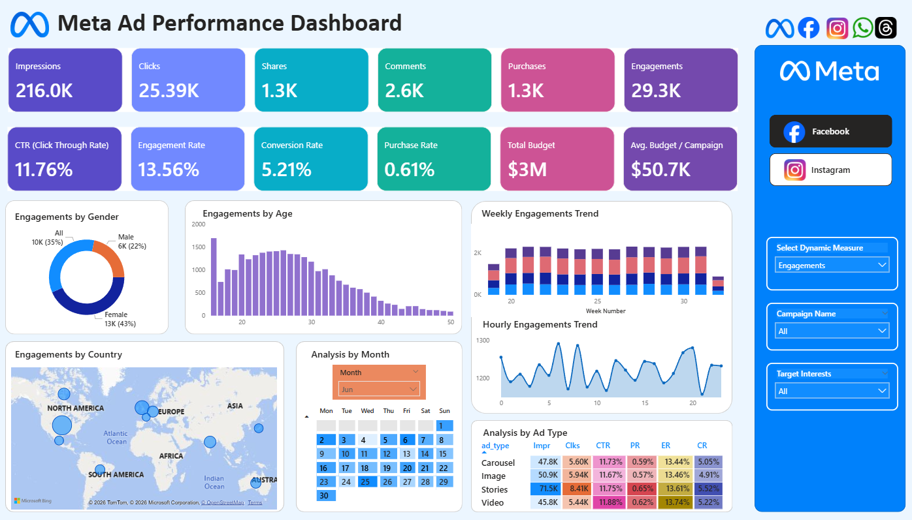
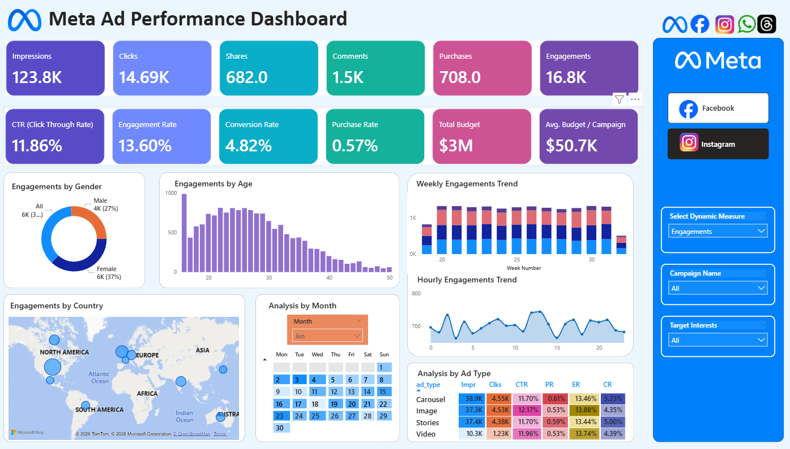
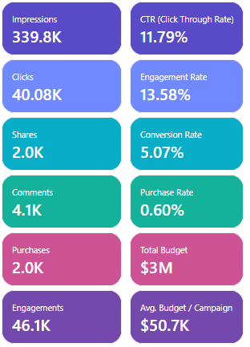

# 📱 Meta Ad Performance Dashboard

A dynamic, interactive multi-page Power BI dashboard analysing Meta advertising performance across Facebook and Instagram — covering 400,000 ad events, 200 ads, 50 campaigns, and 9,841 users across a 3-month period (May–August 2025).

---

## 📌 Short Description / Purpose

The **Meta Ad Performance Dashboard** is a visually engaging Power BI report built to help marketing teams and business leaders monitor ad performance across Meta platforms. The dashboard tracks impressions, clicks, engagements, purchases, and conversion rates — broken down by platform, ad type, demographics, geography, and time — enabling data-driven decisions around campaign strategy, audience targeting, and budget allocation.

---

## 🎯 Business Objective

The business needs a **performance tracking report** for advertising campaigns running on Facebook and Instagram. The report provides visibility into campaign reach, engagement, conversions, and budget utilization — enabling the marketing team to:

- Identify the most effective platform (Facebook vs Instagram)
- Track campaign ROI and optimise budget allocation
- Understand audience engagement patterns

### Scope
| | Details |
|---|---|
| ✅ **In Scope** | Campaigns running on Facebook and Instagram only |
| ❌ **Out of Scope** | Other platforms (Messenger, Audience Network) and organic engagement — only paid ads included |

---

## 🛠️ Tech Stack

| Tool | Purpose |
|------|---------|
| **Power BI Desktop** | Main data visualisation platform |
| **Power Query** | Data transformation, table joins, and calculated columns (`Event Date`, `Event Hour`) |
| **DAX (Data Analysis Expressions)** | Calculated measures for all KPIs and dynamic measure selection |
| **Power BI Map Visual** | Geographic engagement distribution across countries |
| **Calendar Visual** | Month-level drill-down for daily engagement patterns |
| **Custom Tooltip Page** | Hover tooltip showing all KPIs in a single overlay |
| **File Format** | `.pbix` (Power BI Report) + `.pbit` (Template) |

---

## 🧮 DAX Measures

| Measure | Expression | Description |
|---------|------------|-------------|
| `Impressions` | `CALCULATE(COUNTROWS(ad_events), ad_events[event_type] = "Impression")` | Total times ads were displayed — measures reach |
| `Clicks` | `CALCULATE(COUNTROWS(ad_events), ad_events[event_type] = "Click")` | Total clicks — measures engagement intent |
| `Shares` | `CALCULATE(COUNTROWS(ad_events), ad_events[event_type] = "Share")` | Total shares — measures viral engagement |
| `Comments` | `CALCULATE(COUNTROWS(ad_events), ad_events[event_type] = "Comment")` | Total comments — measures user sentiment |
| `Purchases` | `CALCULATE(COUNTROWS(ad_events), ad_events[event_type] = "Purchase")` | Total purchases — measures conversions |
| `Engagements` | `CALCULATE(COUNTROWS(ad_events), ad_events[event_type] IN {"Click","Share","Comment"})` | Clicks + Shares + Comments — total engagement volume |
| `CTR` | `DIVIDE([Clicks], [Impressions])` | % of impressions that resulted in clicks — ad effectiveness |
| `Engagement Rate` | `DIVIDE([Engagements], [Impressions])` | % of impressions that resulted in engagements — overall ad appeal |
| `Conversion Rate` | `DIVIDE([Purchases], [Clicks])` | % of clicks that resulted in purchases — funnel efficiency |
| `Purchase Rate` | `DIVIDE([Purchases], [Impressions])` | % of impressions that resulted in purchases — conversion from reach |
| `Total Budget` | `SUM(campaigns[total_budget])` | Total spend allocated across all campaigns |
| `Avg Budget / Campaign` | `AVERAGE(campaigns[total_budget])` | Average budget per campaign — budget distribution |
| `Dynamic Measure` | `SWITCH(SELECTEDVALUE('Select Dynamic Measure'[Select Dynamic Measure]), "Impressions", [Impressions], "Clicks", [Clicks], ...)` | Returns the selected KPI via disconnected slicer table for dynamic chart rendering |

---

## 🗂️ Data Model

The dashboard uses a **star schema** with `ad_events` as the central fact table, connected to four dimension tables and one disconnected slicer table.

```
campaigns (1) ──→ (*) ads (1) ──────────→ (*) ad_events (*) ←── (1) users
                                                   ↑
                                              (1) Calendar Table

Select Dynamic Measure  [disconnected — drives dynamic measure slicer only]
```

| Relationship | Type | Join Key |
|---|---|---|
| `campaigns` → `ads` | One-to-Many | `campaign_id` |
| `ads` → `ad_events` | One-to-Many | `ad_id` |
| `users` → `ad_events` | One-to-Many | `user_id` |
| `Calendar Table` → `ad_events` | One-to-Many | `Date` → `Event Date` |
| `Select Dynamic Measure` | Disconnected | No relationship — slicer input only |

**Calculated columns added in Power Query:**
- `Event Date` — date extracted from `timestamp`
- `Event Hour` — hour extracted from `timestamp`

**Calendar Table** — auto-generated with `Date`, `Day Name`, `Day Number`, `Month`, and `Week Number` columns, enabling time intelligence across weekly and hourly trend visuals.

**Select Dynamic Measure Table** — a disconnected parameter table. `SELECTEDVALUE()` reads the slicer selection and `SWITCH()` returns the corresponding DAX measure, allowing a single chart visual to render any chosen KPI.

---

## 📂 Data Source

**Source**: Synthetic Meta advertising dataset modelled after how Facebook/Instagram ad platforms capture real-world data.

| Table | Rows | Role | Description |
|-------|------|------|-------------|
| `ad_events` | 400,000 | Fact | Every ad interaction — impressions, clicks, likes, comments, shares, purchases |
| `ads` | 200 | Dimension | Ad details — platform, type, target gender, age group, interests |
| `campaigns` | 50 | Dimension | Campaign name, budget, start/end dates, duration |
| `users` | 9,841 | Dimension | User demographics — gender, age group, country, interests |

**Date Range**: May 2025 – August 2025
**Platforms**: Facebook · Instagram
**Countries**: 10 (US, UK, Canada, India, Germany, Australia, Brazil, Mexico, Japan, France)

---

## 📖 Data Dictionary

### ad_events (Fact Table)
| Column | Type | Description | Use in Analysis |
|--------|------|-------------|----------------|
| `event_id` | Int | Unique event identifier | Primary key |
| `ad_id` | Int | Links to ads table | Join → get platform, ad type |
| `user_id` | String | Links to users table | Join → get demographics |
| `timestamp` | DateTime | Exact date and time of event | Build date hierarchy (Day, Week, Month) |
| `day_of_week` | String | Derived — day name (Monday–Sunday) | Weekday vs weekend performance |
| `time_of_day` | String | Derived — Morning / Afternoon / Evening / Night | When users engage most |
| `event_type` | String | Impression / Click / Like / Comment / Share / Purchase | Funnel analysis |

### ads (Dimension Table)
| Column | Type | Description | Use in Analysis |
|--------|------|-------------|----------------|
| `ad_id` | Int | Unique ad identifier | Primary key; joins to ad_events |
| `campaign_id` | Int | Links to campaigns table | Join → get budget, duration |
| `ad_platform` | String | Facebook / Instagram | Platform performance comparison |
| `ad_type` | String | Image / Video / Carousel / Stories | Performance by creative type |
| `target_gender` | String | Male / Female / All | Targeting efficiency check |
| `target_age_group` | String | 18-24 / 25-34 / 35-44 / All | Target vs actual engagement |
| `target_interests` | String | Comma-separated interest tags | Match vs actual user interests |

### campaigns (Dimension Table)
| Column | Type | Description | Use in Analysis |
|--------|------|-------------|----------------|
| `campaign_id` | Int | Unique campaign identifier | Primary key; joins to ads |
| `name` | String | Campaign name | Reporting and filtering |
| `start_date` | Date | Campaign launch date | Track active campaigns |
| `end_date` | Date | Campaign end date | Duration analysis |
| `duration_days` | Int | Campaign length in days (32–90) | Pacing and performance comparison |
| `total_budget` | Decimal | Budget allocated ($7.9K–$98.9K) | Basis for CPM, CPC, ROAS |

### users (Dimension Table)
| Column | Type | Description | Use in Analysis |
|--------|------|-------------|----------------|
| `user_id` | String | Unique user identifier | Primary key; joins to ad_events |
| `user_gender` | String | Male / Female / Other | Gender-based performance |
| `user_age` | Int | User age (16–65) | Custom segmentation |
| `age_group` | String | 18-24 / 25-34 / 35-44 / 45-54 / 55-65 | Audience engagement by age |
| `country` | String | User's country | Country-level reach analysis |
| `location` | String | User's city | Geo-targeting |
| `interests` | String | Comma-separated interest tags | Match vs targeting interests |

---

## ✨ Features / Highlights

### 🔴 Business Problem

Marketing teams managing Meta campaigns across Facebook and Instagram struggle to answer:

- Which platform delivers better CTR, engagement, and purchase rates?
- Which ad formats (Image, Video, Carousel, Stories) perform best?
- Which age groups and genders engage most with ads?
- Are there specific days, hours, or months where performance peaks?
- Which campaigns and interest segments drive the most conversions?

### 🎯 Goal of the Dashboard

- Provide a single unified view of Meta ad performance across both platforms
- Enable side-by-side Facebook vs Instagram comparison with one click
- Surface demographic, geographic, and temporal patterns in engagement
- Support campaign budget decisions through ad type performance benchmarking

---

## 🖼️ Walkthrough of Key Visuals

### Platform Switcher (Right Panel)
Two buttons — **Facebook** and **Instagram** — switch the entire dashboard view between platforms. The active platform is highlighted in black.

### Key KPIs — Row 1 (Volume Metrics)
| Metric | Overall | Facebook | Instagram |
|--------|---------|----------|-----------|
| Impressions | 339.8K | 216.0K | 123.8K |
| Clicks | 40.08K | 25.39K | 14.69K |
| Shares | 2.0K | 1.3K | 682 |
| Comments | 4.1K | 2.6K | 1.5K |
| Purchases | 2.0K | 1.3K | 708 |
| Engagements | 46.1K | 29.3K | 16.8K |

### Key KPIs — Row 2 (Rate Metrics)
| Metric | Overall | Facebook | Instagram |
|--------|---------|----------|-----------|
| CTR | 11.79% | 11.76% | 11.86% |
| Engagement Rate | 13.58% | 13.56% | 13.60% |
| Conversion Rate | 5.07% | 5.21% | 4.82% |
| Purchase Rate | 0.60% | 0.61% | 0.57% |
| Total Budget | $3M | $3M | $3M |
| Avg Budget / Campaign | $50.7K | $50.7K | $50.7K |

> **Industry context**: CTR of ~11.76% is significantly above the industry average of 1–2%, indicating highly effective ad creatives and targeting.

### Custom Tooltip
Hovering over any visual triggers a **custom tooltip page** showing all 12 KPIs in a compact overlay — without leaving the current view.

### Engagements by Gender (Donut Chart)
**Purpose**: Identify which gender segment contributes most to the selected metric.
- Facebook — Female: 43% | Male: 22% | All: 35%
- Instagram — Female: 37% | Male: 27% | All: 36%
- Females engage more than males — campaigns could be tailored toward female audiences.

### Engagements by Age (Bar Chart)
**Purpose**: Highlight which age group is most responsive to campaigns.
- Peak engagement in the **20–30** age group (especially early 20s)
- Engagement drops significantly after age 35+
- Primary audience = young adults

### Weekly Engagements Trend (Stacked Column Chart)
**Purpose**: Compare ad type contributions over weeks.
- X-axis → Week number (from Calendar Table)
- Stacks → Different `ad_type` values (Image, Video, Carousel, Stories)
- Fairly consistent engagement across weeks — ads maintain attention steadily

### Hourly Engagements Trend (Area Chart)
**Purpose**: Understand user activity patterns throughout the day.
- X-axis → Hour of the day (0–23)
- Peaks around late afternoon & evening (~15–20 hours)
- Lowest engagement early morning (~0–5 hours)

### Engagements by Country (Map Visual)
**Purpose**: Provide a geographic view of campaign reach and engagement.
- US dominates (17,390 engagements), followed by UK (8,520) and Canada (5,713)
- India and Brazil show high engagement volume and growth potential

### Analysis by Month (Calendar Heat Map)
**Purpose**: Detect seasonal trends, peak ad months, and low-activity periods.
- Darker shades indicate higher activity
- Specific dates (e.g., 19th–21st, 25th–27th in June) show higher highlights — likely campaign launches or promotions

### Analysis by Ad Type (Matrix Table)
**Purpose**: Compare performance across ad formats and platforms side by side.

| Ad Type | Impressions | Clicks | CTR | Purchase Rate | Conversion Rate | Engagement Rate |
|---------|------------|--------|-----|--------------|----------------|----------------|
| Carousel | 47.8K | 5.60K | 11.73% | 0.59% | 5.05% | 13.44% |
| Image | 50.9K | 5.94K | 11.67% | 0.57% | 4.91% | 13.46% |
| Stories | 71.5K | 8.41K | 11.75% | 0.65% | 5.52% | 13.61% |
| Video | 45.8K | 5.44K | 11.88% | 0.62% | 5.22% | 13.74% |

### Dynamic Measure Slicer
Dropdown allowing users to switch all relevant visuals between any KPI (Impressions, Clicks, Engagements, CTR, etc.) — powered by a disconnected `Select Dynamic Measure` table and `SWITCH()` DAX pattern.

### Additional Slicers
- **Campaign Name** — filter all visuals to a specific campaign
- **Target Interests** — filter by interest category (art, fashion, gaming, health, news, etc.)

---

## 💡 Final Insights & Recommendations

| # | Insight | Recommended Action |
|---|---------|-------------------|
| 1 | 💡 High CTR (11.76%) & ER (13.56%) but low Purchase Rate (0.60%) — strong top-funnel, weak bottom-funnel | Optimise landing pages, offers, and retargeting campaigns to lift purchase rate |
| 2 | 👩 Females aged 18–30 show the highest engagement across both platforms | Weight ad targeting toward females aged 18–30 for better ROI |
| 3 | 🎬 Video ads lead CTR (11.88%) and Engagement Rate (13.74%) | Prioritise video creatives for high-engagement objectives |
| 4 | 📖 Stories ads have the highest Purchase Rate (0.65%) and Conversion Rate (5.52%) | Use Stories format for conversion and retargeting campaigns — best ROI per impression |
| 5 | 🌍 India & US show high engagement; Germany & UK show higher conversion potential | Run volume campaigns in India & US; run premium conversion campaigns in Germany & UK |
| 6 | 📅 Engagement peaks between 15:00–20:00 hours daily | Schedule ad delivery in afternoon & evening slots for maximum impact |
| 7 | 💰 Budget is evenly spread ($50.7K avg/campaign) | Reallocate budget toward Video & Stories formats and top-performing geographies |

---

## 📸 Dashboard Preview

**Facebook View**



**Instagram View**



**Custom Tooltip**



---

## 📁 File Structure

```
meta-ad-performance-dashboard/
├── Meta___Facebook_Analysis.pbix            # Power BI Report file
├── Meta_Facebook___Instagram_Analysis.pbit  # Power BI Template file
├── ad_events.csv                            # 400,000 ad interaction events
├── ads.csv                                  # 200 ads with targeting details
├── campaigns.csv                            # 50 campaigns with budgets
├── users.csv                                # 9,841 user demographics
├── Business_Requirements_Document.pdf       # BRD — KPI definitions & chart requirements
├── Dashboard_Insights.pdf                   # Analytical insights & recommendations
├── Domain_Knowledge_Document.pdf           # Data model & table field explanations
├── Snapshot_Meta_Facebook.png               # Dashboard preview — Facebook
├── Snapshot_Meta_Instagram.png              # Dashboard preview — Instagram
├── Snapshot_ToolTip.png                     # Custom tooltip preview
└── README.md
```

---

## 🛠️ How to Use

1. Download all CSV files and the `.pbix` file
2. Open `Meta___Facebook_Analysis.pbix` in Power BI Desktop
3. If prompted, reconnect the CSV files as data sources
4. Use the **Facebook / Instagram** buttons to switch platform views
5. Use the **Dynamic Measure** dropdown to change the metric across all charts
6. Filter by **Campaign Name** or **Target Interests** using the right panel slicers
7. Hover over any visual to trigger the **custom KPI tooltip**
8. Use the **calendar visual** to drill into daily engagement patterns by month

> ⚠️ The `.pbit` template file does not contain data — connect to the CSV files on first open.

---

## 💡 Key Power BI / DAX Concepts Used

| Concept | Applied In |
|---------|-----------|
| `CALCULATE` with filter context | Platform-specific and event-type-specific measures |
| `DIVIDE` with safe division | CTR, ER, CR, PR — all protected against divide-by-zero |
| `SWITCH` + `SELECTEDVALUE` | Dynamic measure pattern — single chart renders any selected KPI |
| Star schema data model | Fact (`ad_events`) + 3 dimension tables + Calendar Table |
| Disconnected parameter table | `Select Dynamic Measure` — drives slicer without joining to fact |
| Custom tooltip page | Hover overlay showing all 12 KPIs simultaneously |
| Calendar heat map | Day-level drill-down with activity intensity shading |
| Map visual with bubble sizing | Country-level engagement geographic distribution |
| Stacked column chart | Weekly trend broken down by ad type |
| Platform switcher buttons | Single-click toggle between Facebook and Instagram views |
